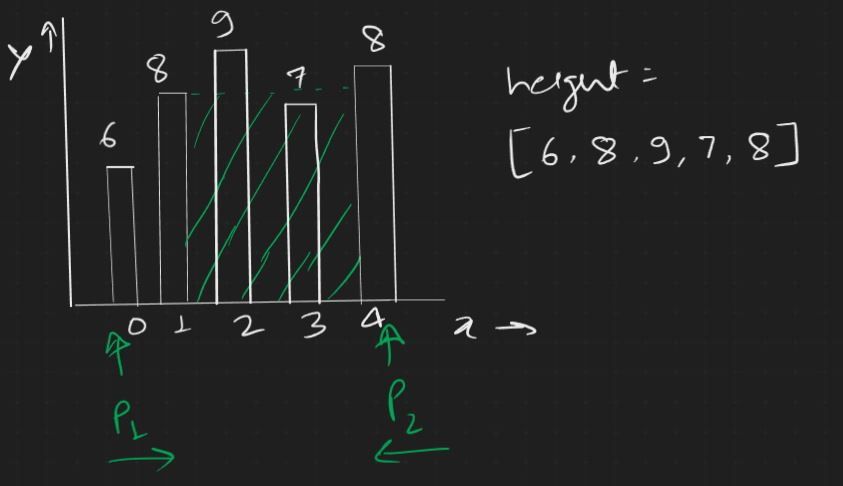
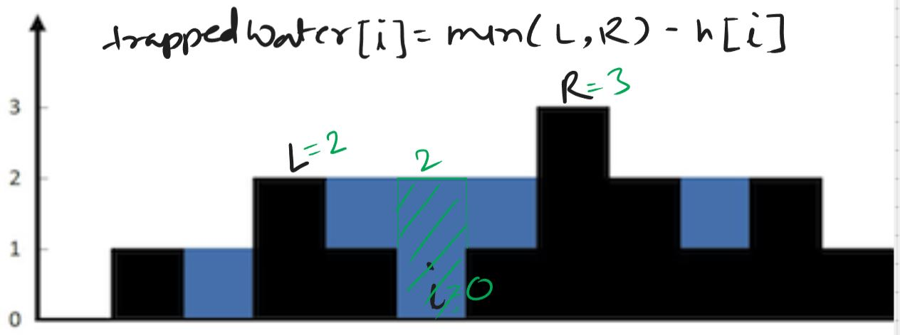
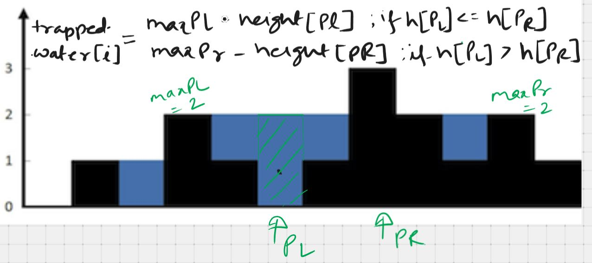
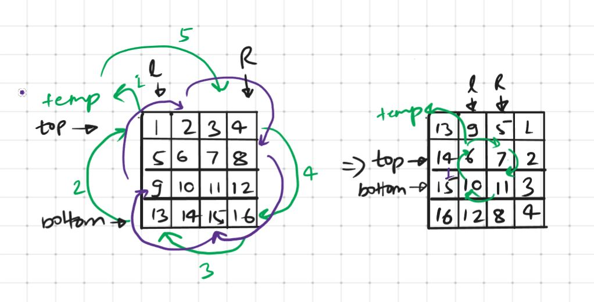

# Javascript Algorithm Questions

```
   _____  .__                       .__  __  .__                    
  /  _  \ |  |    ____   ___________|__|/  |_|  |__   _____   ______
 /  /_\  \|  |   / ___\ /  _ \_  __ \  \   __\  |  \ /     \ /  ___/
/    |    \  |__/ /_/  >  <_> )  | \/  ||  | |   Y  \  Y Y  \\___ \ 
\____|__  /____/\___  / \____/|__|  |__||__| |___|  /__|_|  /____  >
        \/     /_____/                            \/      \/     \/ 
```

## Table of Contents

1. [Array](#array)
   1. [Two Sum](#two-sum)
   2. [Water Container](#water-container)
   3. [Trapping Rain Water](#trapping-rain-water)
   4. [isUnique](#is-unique)
   5. [Rotate Matrix](#rotate-matrix)
2. [String](#string)
   1. [One Away](#one-away)
   2. [Palindrome Permutation](#palindrome-permutation)
   3. [Compress String](#compress-string)
   4. [URLify](#urlify)
   5. [String Permutation](#string-permutation)
   6. [String Rotation](#string-rotation)
   7. [Compare String](#compare-string)

### Array

#### Two Sum

**Problem:** Given an array of integers, `nums` and an integer, `target`, return indices of the two number such that they add up to `target`.

**Constraint/Assumption:**

1. There could at most be one solution.
2. Program should return null when it does not found any solution.
3. There are no negative integer in the `nums` array.
4. There is no duplicate values in the `nums` array.

**Solution:**

```javascript
function twoSum(nums, target) {
  const hashMap = {};
  for (let index=0; index<nums.length; index++) {
    let value = nums[index];
    // if hashMap has the value
    if(hashMap[value] !== undefined) {
      return [index, hashMap[value]];
    }
    let numToFind = target - nums[index];
    hashMap[numToFind] = index;
  }
  return null;
}
```

**[⬆ back to top](#table-of-contents)**

#### Water Container

**Problem**: You are given an array `height` of positive integers where each integer represents the height of a vertical line on a chart. Find two line which together with the x axis forms a container that would hold the greatest amount of water. Returns the area of water.

**Constraint/Assumption:**

1. y-axis not to be considered as a line
2. Minimum two numbers are present in the array.
3. Height can have values as zero

**Solution**:



```javascript
function waterContainer(height) {
  let area = 0;
  let tempArea = 0;
  let p1 = 0;
  let p2 = height.length - 1;
  while (p1 < p2) {
    tempArea = (p2-p1)*(Math.min(height[p1], height[p2]));
    area = Math.max(area, tempArea);
    if (height[p1] < height[p2]) {
      p1++;
    } else {
      p2--;
    }
  }
  return area;
}
```

**[⬆ back to top](#table-of-contents)**

#### Trapping Rain Water

**Problem:**  Given n non-integers representing an elevation map where width of each bar is 1, compute how much water it can trap after raining.

**Constraint/Assumption:**

1. y-axis not to be considered for trapping water
2. Array contains only non-negative numbers.
3. Minimum 1 number is present in the array.

**Solution:**

In order to get the trapped water at index `i`, you have to know the height of left and right bars to get `maxL` and `maxR`, whereas

`maxL` = largest bar in the left side of the index	

`maxR` = largest bar in the right side of the index

and then calculate the trapped water at each index. Although this method results in O(n) time complexity, which is optimal. however in this method, you have to create 3 arrays for each index (`maxL`,` maxR` and `min(maxL, maxR)`). This will result in space complexity of O(n). 

However space complexity of O(1) can be achieved if instead of one pointer, two pointer mechanism is used.





```javascript
function trapRain(height) {
  let trappedWater = 0;
  let area = 0;
  let pl = 0;
  let pr = height.length-1;
  let maxPl = 0;
  let maxPr = 0;
  while (pl < pr) {
    if(height[pl] <= height[pr]) {
      trappedWater = Math.max((maxPl - height[pl]), 0)
      area += trappedWater;
      pl++;
    } else {
      trappedWater = Math.max((maxPr - height[pr]), 0)
      area += trappedWater;
      pr--;
    }
  }
  return area;
}
```

**[⬆ back to top](#table-of-contents)**

#### Is Unique

**Problem:** Implement an algorithm to determine if a string has all unique characters. 

**Constraint/Assumption:** 

1. Strings are ASCII strings instead of unicode

**Solution:** 

```javascript
function isUnique(text) {
  const charSet = new Set();
  for (let char of text) {
    if (charSet.has(char)) {
      return false;
    }
    charSet.add(char);
  }
  return true;
}
```

**[⬆ back to top](#table-of-contents)**

#### Zero Matrix

**Problem:** Write an algorithm such that if an element in an M x N matrix is 0, its entire row and column are set to 0

**Solution:**

```javascript
function findingZero(matrix) {
  let zeroList = [];
  for (let i=0; i<matrix.length; i++) {
    for (let j=0; j<matrix.length; j++) {
      if (matrix[i][j] === 0) {
        zeroList.push([i,j]);
      }
    }
  }
  return zeroList;
}

function makeZero(zeroList, matrix) {
  for (let arr of zeroList) {
    let [r, c] = arr;
    for (let i=0; i<matrix.length; i++) {
      matrix[r][i] = 0;
      matrix[i][c] = 0;
    }
  }
  return matrix;
}

function zeroMatrix(matrix) {
  return makeZero(findingZero(matrix), matrix);
}
```

**[⬆ back to top](#table-of-contents)**

#### Rotate Matrix

**Problem:** Given a Matrix of NxN size, write a method to rotate the matrix by 90 degrees 

**Constraint/Assumptions:**

1. Matrix will contain only integer values
2. no of rows and columns are equal

**Solution:**



```javascript
function rotateMatrix(matrix) {
  let l = 0;
  let r = matrix.length-1 
  let temp = 0;
  while (l < r) {
    for (i=0; i<r-l; i++) {
      let top = l;
      let bottom = r;
      temp = matrix[top][l+i];
      matrix[top][l+i] = matrix[bottom-i][l];
      matrix[bottom-i][l] = matrix[bottom][r-i];
      matrix[bottom][r-i] = matrix[top+i][r];
      matrix[top+i][r] = temp;
    }
    l++;
    r--;
  }
  return matrix;
}
```

**[⬆ back to top](#table-of-contents)**

### String

#### One Away

**Problem:** There are three types of edit that can be performed on a string: insert a character, remove a character or replace a character. Given two string, write a function to check if they are one edit away.

**Constraint/Assumption:**

1. There is no space in the provided strings
2. All letters are case sensitive
3. Insertion, Removal and Replacement can be done at any index.

**Solution:**

This is one of those problem where it is helpful to think about the meaning of each operation. We can consider insertion and removal as same operation, as removal can be thought as reverse of insertion. Furthermore, replacement can be consider as separate than other two.

Length of the string signifies the type of operation required to make both strings equal. If the length of both string is same, only replacement may be required whereas if the difference in length is one then insertion or removal is required. All remaining cases are to be considered as false.

```javascript
function isOneEditAway([first, second]) {
  if (first.length === second.length) {
    return checkWithReplacement(first, second);
  } else if (Math.abs(first.length - second.length) === 1) {
    return checkWithInsertion(first, second);
  } else {
    return false;
  }
}

function checkWithReplacement(first, second) {
  let noOfDiff = 0;
  let lp = 0;
  let rp = 0;

  while (lp < first.length) {
    if (first[lp] !== second[rp]) {
      noOfDiff++;
    }
    lp++;
    rp++;
  }
  return (noOfDiff > 1) ? false : true;
}

function checkWithInsertion(first, second) {
  let lp = 0;
  let rp = 0;
  let noOfDiff = 0;
  let temp='';

  if (first.length < second.length) {
    temp = first;
    first = second;
    second = temp;
  }
  while (lp < first.length) {
    if (first[lp] === second[rp]) {
      lp++;
      rp++;
    } else {
      noOfDiff++;
      lp++;
    }
  }
  return (noOfDiff > 1) ? false : true;
}
```

**[⬆ back to top](#table-of-contents)**

#### Palindrome Permutation

**Problem:** Given a string, write a function to check it is a permutation of a palindrome. A palindrome is a word or phrase that is the same forwards and backwards.

**Constraint/Assumption:**
1. palindrome does not need to be limited to just dictionary words
2. spaces should not be considered in a palindrome
3. all the letters to be case insensitive

**Solution:** 

```javascript
function permutePalindrome(text) {
  text = text.toLowerCase();
  let textHist = {};
  let length = 0;
  for (let char of text) {
    if (char !== ' ') {
      if (textHist[char] !== undefined){
        textHist[char] += 1;
        length ++;
      } else {
        textHist[char] = 1;
        length ++;
      }
    }
  }
  let noOfOddChar = 0	
  for (let item in textHist) {
    if (textHist[item] %2 !== 0) {
      noOfOddChar += 1
    }
  }

  if (length % 2 === 0 ) {
    if (noOfOddChar === 0) {
      return true;
    } else {
      return false;
    }
  } else {
    if (noOfOddChar === 1) {
      return true;
    } else {
      return false;
    }
  }
}
```
**[⬆ back to top](#table-of-contents)**

#### Compress String

**Problem:** Implement a method to perform basic string compression using the counts of repeated characters. For example, the string "aabcccccaaa" would become "a2b1c5a3". It the compressed string would not become smaller than the original string, your method should return the original string.

**Constraint/Assumption:** 

1. string only has uppercase and lowercase letters (a-z).
2. string can also have spaces in between.

**Solution:** 

Although the operation happens with O(n) time complexity, the overall
time complexity will depends on the string concatenation operation, which sometimes run with O(n2) time complexity. it is also advisable to check in advance whether new compressed string is shorter than the actual string so that we don't create a string that is never used.

```javascript
function compressString(str) {
  let compressed = '';
  let ptr = 0;
  while (ptr < str.length) {
    let count = 1;
    while(str[ptr] === str[ptr+1]) {
      count++;
      ptr++;
    }
    compressed += str[ptr] + String(count);
    ptr++;
  }
  
  return (compressed.length < str.length) ? compressed : str;
}
```

**[⬆ back to top](#table-of-contents)**

#### URLify

**Problem:**  Write a method to replace all spaces in a string with %20. True length of the string is also provided

**Constraint/Assumption:**

1. string has sufficient space at the end to hold the additional characters.
2. multiple spaces must not be considered as single space

**Solution:**

```javascript
function urlify(text) {
  let url = text;
  let index = url.length-1;
  while (index > 0) {
    while (url[index] !== ' ' && index > 0) {
      index -= 1;
    }
    if (url[index] === ' ') {
      url = url.slice(0,index) + "%20" + url.slice(index+1);
    }
    index -= 1;
  }
  return url
}
```

**[⬆ back to top](#table-of-contents)**

#### String Permutation

**Problem:** Given two string, write a method to decide if one is a 
permutation of the other.

**Constraint/Assumption:**

1. Strings are case sensitive
2. Whitespace is significant

**Solution:**

```javascript
function stringPermutation(str1, str2) {
  if (str1.length !== str2.length) {
    return false;
  }

  const strHist = {}
  for (let char of str1) {
    if (strHist[char] !== undefined) {
      strHist[char] += 1;
    } else {
      strHist[char] = 1;
    }
  }
  console.log(strHist);

  for (let char of str2) {
    if (strHist[char] === undefined) {
      return false;
    }
    strHist[char] -= 1;
  }

  for (let keys in strHist) {
    if (strHist[keys] !== 0) {
      return false
    }
    return true;
  }
}
```

**[⬆ back to top](#table-of-contents)**

#### String Rotation

**Problem:** Assume you have a method `isSubstring` which checks if one word is a substring of another. Given two strings, s1 and s2, write code to check if s2 is a rotation of s1 using only one call to `isSubstring`.
**Solution:** 

```javascript
s1 = 'waterbottle'
s2 = 'erbottlewat'   // is a rotation of s1
x = 'wat'
y = 'erbottle'
s2 = yx
s1 = xy
s1s1 = 'wat{erbottlewat}erbottle'  // here one can find s2
```


which means that if s2 is a rotation of s1, then s2 will always be a substring of s1s1

```javascript
// is s2 a substring of s1
function isSubstring([s1, s2]) {
  let p1 = 0;
  let p2 = 0;
  while (p1 < s1.length) {
    let check = true;
    while (p2 < s2.length) {
      if (s1[p1] !== s2[p2]) {
        check = false;
        p1++;
        p2++;
        break;
      }
      p1++;
      p2++;
    }
    if (check) return true;
  }
  return false;
}

// is s2 a rotation of s1
function stringRotation([s1, s2]) {
  if (s1.length !== s2.length) return false;
  let doubleS1 = s1 + s1;
  return doubleS1.includes(s2)
}

```

**[⬆ back to top](#table-of-contents)**

#### Compare String

**Problem:** Given two strings `s` and `t`, return true if they are equal when both are typed into empty text editors. Here, empty text editor just employ backspace whenever it encounters '#' 

**Constraint/Assumptions:**

1. 1 <= `s.length`, `t.length` <=200

2. s and t have both lowercase letters and '#' characters

**Solution:**

```javascript
const compareStringOptimized = function(s, t) {
  let p1=s.length-1, p2=t.length-1;
  while (p1>=0 || p2>=0) {
    if (s[p1] != '#' && t[p2] != '#') {
      if (s[p1] != t[p2]) {
        return false;
      }
      p1--;
      p2--;
    }
    if (s[p1] == '#') {
      let count=0;
      while (s[p1] == '#') {
        count++;
        p1--;
      }
      while (count>0) {
        if(s[p1] != '#') {
          p1--;
          count--;
        }
        else {
          p1--;
          count++;
        }
      }
    }
    if (t[p2] == '#') {
      let count=0;
      while (t[p2] == '#') {
        count++;
        count++;
        p2--;
      }
      while (count>0) {
        if(t[p2] != '#') {
          p2--;
          count--;
        }
        else {
          p2--;
          count++;
        }
      }
    }
  }
  return true;
}
```

**[⬆ back to top](#table-of-contents)**